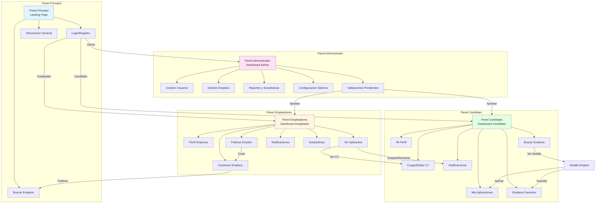

# Análisis de Vistas - Portal de Empleo
## Simulación de Conexiones tipo Figma

---

## 📊 Diagrama de Flujo Principal



---

## 🎨 Estructura Detallada de Vistas

### 1. Panel Principal (`/portalempleo/Vistas Panel Principal/`)

#### Componentes Principales:
- **Landing Page** (`landing.pug` / `Landing.jsx`)
  - Hero Section con búsqueda de empleos
  - Categorías de empleos destacadas
  - Estadísticas del portal
  - Testimonios

- **Búsqueda de Empleos** (`buscar-empleos.pug` / `BuscarEmpleos.jsx`)
  - Filtros avanzados (ubicación, salario, tipo)
  - Lista de resultados
  - Paginación

- **Login/Registro** (`login.pug` / `Login.jsx`)
  - Formulario de login
  - Opciones de registro (Candidato/Empleador)
  - Recuperación de contraseña

#### Conexiones:
```
Panel Principal
    ├─→ Login → Panel Administrador (si rol = admin)
    ├─→ Login → Panel Candidato (si rol = candidato)
    ├─→ Login → Panel Empleadores (si rol = empleador)
    └─→ Buscar Empleos → Detalle Empleo → Panel Candidato (aplicar)
```

---

### 2. Panel Administrador (`/portalempleo/Vistas Panel Administrador/`)

#### Componentes Principales:
- **Dashboard Admin** (`dashboard-admin.pug` / `DashboardAdmin.jsx`)
  - Métricas generales (usuarios, empleos, aplicaciones)
  - Gráficos de actividad
  - Alertas y notificaciones

- **Gestión de Usuarios** (`gestion-usuarios.pug` / `GestionUsuarios.jsx`)
  - Lista de usuarios (Candidatos y Empleadores)
  - Activar/Desactivar usuarios
  - Ver perfiles completos

- **Gestión de Empleos** (`gestion-empleos.pug` / `GestionEmpleos.jsx`)
  - Lista de todos los empleos publicados
  - Aprobar/Rechazar empleos
  - Editar/eliminar empleos

- **Reportes y Estadísticas** (`reportes.pug` / `Reportes.jsx`)
  - Reportes de actividad
  - Exportación de datos
  - Análisis de tendencias

- **Validaciones Pendientes** (`validaciones.pug` / `Validaciones.jsx`)
  - Validar empresas nuevas
  - Validar documentos de candidatos
  - Aprobar perfiles

#### Conexiones:
```
Panel Administrador
    ├─→ Gestión Usuarios → Perfil Usuario (ver/editar)
    ├─→ Gestión Empleos → Detalle Empleo (ver/editar)
    ├─→ Validaciones → Panel Empleadores (aprobar empresa)
    ├─→ Validaciones → Panel Candidato (aprobar perfil)
    └─→ Reportes → Exportar datos
```

---

### 3. Panel Candidato (`/portalempleo/Vistas Panel Candidato/`)

#### Componentes Principales:
- **Dashboard Candidato** (`dashboard-candidato.pug` / `DashboardCandidato.jsx`)
  - Resumen de aplicaciones
  - Empleos recomendados
  - Estado de aplicaciones

- **Mi Perfil** (`mi-perfil.pug` / `MiPerfil.jsx`)
  - Información personal
  - Experiencia laboral
  - Educación
  - Habilidades

- **CV** (`cv.pug` / `CV.jsx`)
  - Cargar CV (PDF)
  - Editor de CV online
  - Plantillas de CV
  - Vista previa

- **Mis Aplicaciones** (`mis-aplicaciones.pug` / `MisAplicaciones.jsx`)
  - Lista de empleos aplicados
  - Estado de cada aplicación
  - Fecha de aplicación

- **Buscar Empleos** (`buscar-empleos-candidato.pug` / `BuscarEmpleosCandidato.jsx`)
  - Búsqueda personalizada
  - Filtros guardados
  - Alertas de nuevos empleos

- **Empleos Favoritos** (`favoritos.pug` / `Favoritos.jsx`)
  - Lista de empleos guardados
  - Aplicar desde favoritos

- **Notificaciones** (`notificaciones-candidato.pug` / `NotificacionesCandidato.jsx`)
  - Notificaciones de aplicaciones
  - Mensajes de empleadores
  - Alertas de nuevos empleos

#### Conexiones:
```
Panel Candidato
    ├─→ Buscar Empleos → Detalle Empleo → Aplicar → Mis Aplicaciones
    ├─→ Detalle Empleo → Guardar → Favoritos
    ├─→ Mi Perfil → CV → Panel Empleadores (visible al aplicar)
    ├─→ Mis Aplicaciones → Ver Detalle → Panel Empleadores (aplicante)
    └─→ Notificaciones ← Panel Empleadores (respuesta aplicación)
```

---

### 4. Panel Empleadores (`/portalempleo/Vistas Panel Empleadores/`)

#### Componentes Principales:
- **Dashboard Empleador** (`dashboard-empleador.pug` / `DashboardEmpleador.jsx`)
  - Empleos publicados
  - Aplicaciones recibidas
  - Estadísticas de publicaciones

- **Perfil Empresa** (`perfil-empresa.pug` / `PerfilEmpresa.jsx`)
  - Información de la empresa
  - Logo y descripción
  - Ubicación
  - Redes sociales

- **Publicar Empleo** (`publicar-empleo.pug` / `PublicarEmpleo.jsx`)
  - Formulario de creación
  - Requisitos y beneficios
  - Tipo de contrato y salario

- **Gestionar Empleos** (`gestionar-empleos.pug` / `GestionarEmpleos.jsx`)
  - Lista de empleos publicados
  - Editar empleos
  - Pausar/Activar empleos
  - Eliminar empleos

- **Ver Aplicantes** (`aplicantes.pug` / `Aplicantes.jsx`)
  - Lista de candidatos por empleo
  - Ver CV de candidatos
  - Aceptar/Rechazar aplicaciones
  - Enviar mensajes

- **Notificaciones** (`notificaciones-empleador.pug` / `NotificacionesEmpleador.jsx`)
  - Nuevas aplicaciones
  - Mensajes de candidatos
  - Recordatorios

- **Estadísticas** (`estadisticas-empleador.pug` / `EstadisticasEmpleador.jsx`)
  - Vistas por empleo
  - Aplicaciones por empleo
  - Métricas de contratación

#### Conexiones:
```
Panel Empleadores
    ├─→ Publicar Empleo → Gestionar Empleos → Panel Principal (visible)
    ├─→ Gestionar Empleos → Ver Aplicantes → Panel Candidato (ver CV)
    ├─→ Ver Aplicantes → Aceptar/Rechazar → Panel Candidato (notificación)
    ├─→ Perfil Empresa → Panel Administrador (validación)
    └─→ Estadísticas → Reportes
```

---

## 🔗 Matriz de Conexiones entre Paneles

| Desde | Hacia | Acción | Tipo de Conexión |
|-------|-------|--------|------------------|
| Panel Principal | Panel Administrador | Login Admin | Autenticación |
| Panel Principal | Panel Candidato | Login Candidato | Autenticación |
| Panel Principal | Panel Empleadores | Login Empleador | Autenticación |
| Panel Principal | Panel Candidato | Ver Empleo → Aplicar | Navegación |
| Panel Candidato | Panel Empleadores | Aplicar → Ver CV | Datos Compartidos |
| Panel Empleadores | Panel Candidato | Aceptar/Rechazar → Notificación | Notificación |
| Panel Administrador | Panel Empleadores | Validar Empresa | Autorización |
| Panel Administrador | Panel Candidato | Validar Perfil | Autorización |
| Panel Empleadores | Panel Principal | Publicar Empleo → Visible | Publicación |
| Panel Candidato | Panel Empleadores | Aplicar → Ver Aplicante | Datos Compartidos |

---

## 🎯 Flujos de Usuario Principales

### Flujo 1: Candidato busca y aplica a empleo
```
Panel Principal (Buscar)
    ↓
Detalle Empleo
    ↓
Panel Candidato (Aplicar)
    ↓
Mis Aplicaciones
    ↓
Panel Empleadores (Ver Aplicante)
    ↓
Panel Candidato (Notificación)
```

### Flujo 2: Empleador publica empleo
```
Panel Empleadores (Publicar)
    ↓
Gestionar Empleos
    ↓
Panel Administrador (Validar - opcional)
    ↓
Panel Principal (Visible)
    ↓
Panel Candidato (Ver y Aplicar)
```

### Flujo 3: Administrador gestiona sistema
```
Panel Administrador
    ├─→ Validar Empresa → Panel Empleadores (Activar)
    ├─→ Validar Candidato → Panel Candidato (Activar)
    ├─→ Gestionar Empleos → Editar/Eliminar
    └─→ Reportes → Exportar
```

---

## 📱 Componentes Compartidos

### Componentes Reutilizables:
1. **Header/Navbar**
   - Usado en: Todos los paneles
   - Variaciones según rol

2. **Card de Empleo**
   - Usado en: Panel Principal, Panel Candidato, Panel Empleadores
   - Muestra: Título, empresa, ubicación, salario

3. **Modal de Detalle**
   - Usado en: Ver detalles de empleo, CV, perfil
   - Reutilizable con diferentes contenidos

4. **Formulario de Búsqueda**
   - Usado en: Panel Principal, Panel Candidato
   - Filtros comunes

5. **Sistema de Notificaciones**
   - Usado en: Todos los paneles
   - Badge de notificaciones pendientes

---

## 🎨 Estilos y Temas por Panel

| Panel | Color Principal | Estilo |
|-------|----------------|--------|
| Panel Principal | Azul (#2196F3) | Público, profesional |
| Panel Administrador | Rojo/Morado (#9C27B0) | Administrativo, serio |
| Panel Candidato | Verde (#4CAF50) | Amigable, motivador |
| Panel Empleadores | Naranja (#FF9800) | Empresarial, confiable |

---

## 📋 Checklist de Implementación

### Panel Principal
- [ ] Landing page responsive
- [ ] Sistema de búsqueda funcional
- [ ] Login/Registro integrado
- [ ] Listado de empleos destacados
- [ ] Filtros de búsqueda

### Panel Administrador
- [ ] Dashboard con métricas
- [ ] CRUD de usuarios
- [ ] CRUD de empleos
- [ ] Sistema de validaciones
- [ ] Reportes exportables

### Panel Candidato
- [ ] Dashboard personalizado
- [ ] Editor de perfil completo
- [ ] Gestor de CV
- [ ] Seguimiento de aplicaciones
- [ ] Sistema de favoritos

### Panel Empleadores
- [ ] Dashboard empresarial
- [ ] Publicación de empleos
- [ ] Gestión de aplicantes
- [ ] Estadísticas de publicaciones
- [ ] Mensajería con candidatos

---

## 🔐 Control de Acceso

```
Panel Principal
    ├─→ Acceso: Público
    └─→ Requiere autenticación: Solo para acciones (aplicar, guardar)

Panel Administrador
    ├─→ Acceso: Solo Admin
    └─→ Permisos: Total control del sistema

Panel Candidato
    ├─→ Acceso: Candidatos autenticados
    └─→ Permisos: Gestionar propio perfil y aplicaciones

Panel Empleadores
    ├─→ Acceso: Empleadores autenticados
    └─→ Permisos: Gestionar empleos y ver aplicantes
```

---
